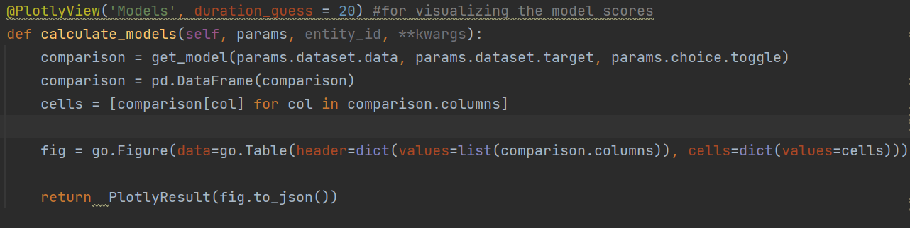
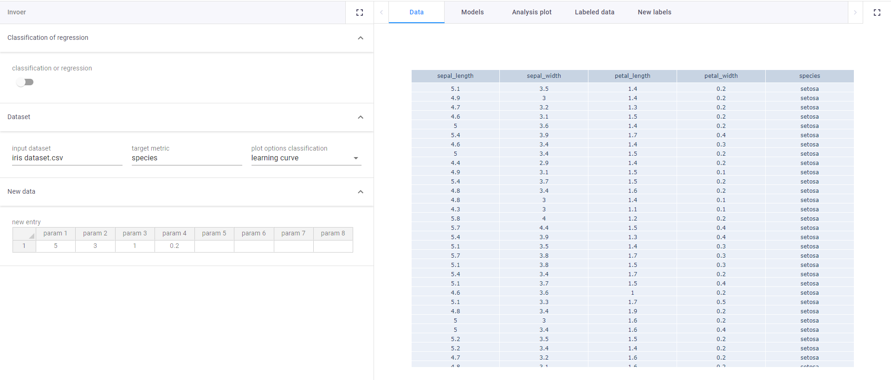
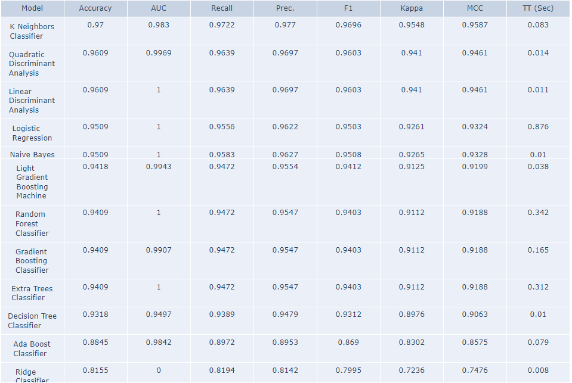
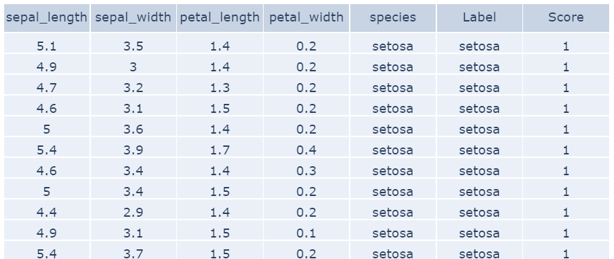
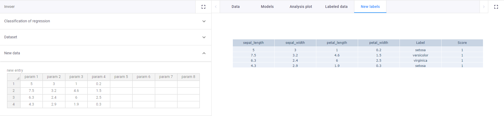

# AutoML app
Sample app to show how easy it can be to distribute versatile machine learning solutions to people with no experience in it

The app contains a toggle to distinguish between classification and regression machine learning. It has an input
field for the name/path of your .csv so it can find it. It has a target where the column that needs to be learned
an be distinguished. It has different analysis plots that can be visualized. Lastly it has a table input at the bottom
where new data can be put in, after which the model can predict the new property for you.

## Using the functionality
There are two ways in which you can use the functionality: 

With VIKTOR, out-of-the-box, using our [free version](https://www.viktor.ai/try-for-free).

Without VIKTOR, in that case you integrate with your own Python code.

This is a snippet of the functionality’s code from app/AI/controller.py 

This is where with as little as three parameters the 
any user can make machine learning models.

**Apply for a [demo account](https://www.viktor.ai/demo-environment) to get access to this and all other VIKTOR sample applications.** 

## AI for everyone
In the app a user can give the path to their csv file, and which column they 
would like to predict.

The back-end then handles everything and conveniently shows users
the results for all tested models. 

The user can then see some plots to evaluate the
model performance. The dataset is then labeled
according to the model predictions so outcomes can
be compared.

And finally users can now see what outcomes prediction
on their new data will yield.

This can drastically reduce the amount of possibilities
that need to be researched if prediction is good.
